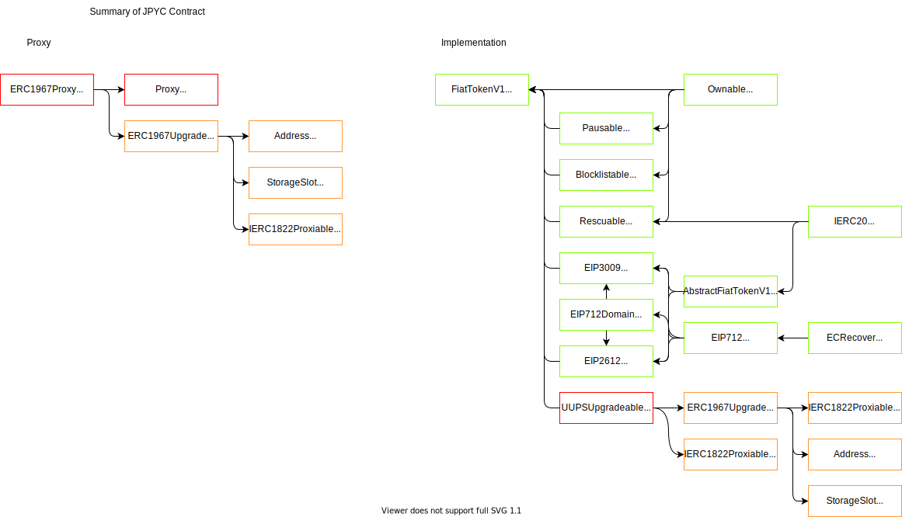

**本リポジトリは Stable coin 理解のための私の写経用である。**
なお、以下では[JPYC 公式 README](https://github.com/jcam1/JPYCv2/blob/main/japanese/README.md)をほぼ引用してきているが、私の理解促進のために一部手を加えた部分もある。なので JPYC 公式の文を引用しているものの、JPYC 公式のものではないことに注意されたい。

# JPYC - 日本円ステーブルコインプロトコル

## 概要

- JPYC v2 は ERC20 トークン
- 複数のエンティティによる通貨発行ができる
- コントラクトの一時停止ができる
- 特定アカウントのブロックできる
- 当該コントラクトに誤送信されたトークンの引き出しができる
- バグの修正あるいは機能を追加するためにスマートコントラクトのアップグレードができる

## プロトコルの構造



## Solidity バージョン

Solidity のバージョンについては、`pragma solidity 0.8.11`を使用している。

## Proxy

### UUPS 方式を採用

JPYC v2 は UUPS 方式の upgrade proxy pattern を採用している。採用した背景には以下の点がある。

- シンプルさ
- ガス代が安い
- upgradeability の柔軟性の高さ
- openzeppelin 推奨

upgrade 方式の選択にあたって[transparent 方式、UUPS 方式](https://docs.openzeppelin.com/contracts/4.x/api/proxy#transparent-vs-uups)または EIP2535 についての検討を実施した。

### UUPS Proxy Pattern

UUPS 方式は openzeppelin team にも推奨されている理由として、多機能で軽量という特徴を持っている。
UUPS 方式の構成

- Proxies

  UUPS proxies は ERC1967Proxy コントラクトを使っている。Proxy 自体はアップグレード可能ではない。呼び出しを Implementation 側へ転送（delegate）している

- Implementation

  UUPS の Implementation は UUPSUpgradeable コントラクトを継承し`upgradeTo`関数を持つ。そこでアップデートしたい時に、Implementation コントラクトから`upgradeTo`または`upgradeToAndCall`関数を呼び出してアップグレードする。

### UUPS コントラクトについて

OpenZeppelin の[UUPS upgradeable pattern](https://github.com/OpenZeppelin/openzeppelin-contracts/tree/master/contracts/proxy)を採用している。変更した点は`uint256[50] private _gap;`を追加している。これは将来的にコントラクトの更新（例：新しい状態変数の追加）がある場合のために用意している。

#### Proxy.sol

- `_fallback`関数：proxy への呼び出しを implementation 側へ転送（delegate）する。`_implementation`関数は`virtual`修飾子がついているので、`ERC1967Proxy.sol`にて override している。

#### UUPSUpgradeable.sol

UUPS proxies のメカニズムを構成する重要なコントラクトである。メインとなる`FiatTokenV1.sol`のコントラクトが`UUPSUpgradeable`コントラクトを継承することで JPYC v2 は upgradeability を持てるようになる。

Note: `_authorize`関数に関しては override してあげる必要がある。Implementation のコントラクト`FiatTokenV1`においては以下のように修飾子`onlyOnwer`をつけることで onwer にのみアップグレード権限を与えている。

```
    function _authorizeUpgrade(address newImplementation)
        internal
        override
        onlyOwner
    {}
```

#### ERC1967Upgrade.sol

[EIP1967](https://eips.ethereum.org/EIPS/eip-1967)から由来している。

#### ERC1967Proxy.sol

これは Proxy contract の本体で、`_logic`、`_data`を引数にしてイニシャライズされる。

- `constructor()`
  - `_logic`: Implementation の contract address
  - `_data`: `_logic` address に向けて delegatecall の data として`_data`を使って呼び出す。こうすることで proxy のイニシャライズをすることができる。
- `_implementation()`
  - 現在の implementation contract address を返す

## implementation

実際の JPYC v2 token のロジックが書かれているコントラクト

### explanation of implementation contract

- [centre-tokens](https://github.com/jcam1/JPYCv2/tree/japaneseReadme#:~:text=with%20reference%20to-,the%20centre%2Dtokens,-%2C%20Which%20is%20a)をフォークしている。実際にフォークした内容に関してはコントラクトに記載されている。
- コントラクトごとに`gap`を宣言している。

#### Ownable.sol

アクセス権限を管理するためのもの。OpenZeppelin の Library をフォークしている。変更点としては`renounceOwnership`関数を削除している。

#### Pausable.sol

コントラクトの停止措置を管理するためのもの。一時停止（Pause）する時に、JPYC token の一部の機能は制限されることになる。

#### Blocklistable.sol

コントラクトのブロックリスト機能を管理するためのもの。

#### Rescuable.sol

間違えて当該コントラクトへ送信してしまった token の救済をするためのもの。

#### EIP712Domain.sol

EIP712 の Domain Separator を保存している。Chain ID が異なる場合、再計算される。EIP3009 や EIP2612 は EIP712 の Domain を必要とする。

https://github.com/ethereum/EIPs/blob/master/EIPS/eip-712.md

#### EIP2612.sol

署名による権限の移譲でファンジブルなトークンを送信することを可能にしたもの。コントラクトは v、r または s を使ってアドレスを復元させてアドレス所有者であることの確認を取っている。

- nouces
  - ユーザーごとに`nonce`がある。同じ`nonce`は一度しか使えない。nonce は順番に増える
  - `block.time`の確認をする
  - 復元アドレスは owner と同じであれば`_approve`をする

https://eips.ethereum.org/EIPS/eip-2612

#### EIP3009.sol

署名による権限の移譲でファンジブルなトークンを送信することを可能にしたもの。コントラクトは v、r または s を使ってアドレスを復元させてアドレス所有者であることの確認を取っている。

EIP2612 との違いは nonce は順番に増えていく形式ではなくランダムに生成されるので、トランザクションが失敗する心配がなく複数の権限移譲が可能。

- `authorizationState`
  - ユーザーごとに`nonce`がある。同じ`nonce`は一度しか使えない
  - nonce はランダムに生成
- `_transferWithAuthorization`
- `_receiveWithAuthorization`
  - 宛先のアドレスは`msg.sender`でなければならない
- `_cancelAuthorization`
  - `nonce`を無効にする
- `_requireUnusedAuthorization`
  - `nonce`が使われたかをチェック
- `_requireValidAuthorization`
  - `block.time`をチェックする
- `_markAuthorizationAsUsed`
  - `nonce`を使用済みにして event を放出

https://eips.ethereum.org/EIPS/eip-3009

#### FiatTokenV1

JPYC v2 の Implementation contract。

- 主なロジック（ERC20 token など）が含まれている。
  - minterAdmin のアクセス管理
  - `initialize`関数
    - `blocklisted[address(this)] = true`
    - `makeDomainSeparator(name, "1")`
    - `initialized = true`
  - `mint`, `burn`, `increaseAllowance`, `decreaseAllowance`関数
  - `_authorizeUpgrade`関数に`onlyOwner`修飾子をつけた

#### FiatTokenV2

- 仮説上 JPYC v2 をアップグレードさせる場合に使用される Implementation contract。
- 仮設上の新規な機能`allowlist`を追加
- その他は`FiatTokenV1`と同じ

### Note

- `ERC1967Upgradeable`を使用しているが、部分的にしか使われていないので、その部分に関しては削除した。

## ロール

JPYC v2 には新しい機能の Pausability, Blocklistability が存在し、それらの機能を管理する権限をもつロールは Pauser、Blocklister という。JPYC 社がそういった管理権限のロールを担っている。ロールがどのような場合にそういった機能を実行するかについて説明する。

### Pauser

- Pauser は JPYC v2 の一時停止機能をコントロールできる
- JPYC を利用する全てのユーザーが不利益を被る可能性が高いと JPYC 社が判断した場合に、JPYC トークンの送受信、発行、approve などの機能を停止する。
  - 例:JPYC の重要な機能を実行する権限のある秘密鍵が流出した場合
- JPYC のコントラクトに重大なバグが発見された場合

### Blocklister

- Blocklister は JPYC v2 の blocklist 機能をコントロールできる
- JPYC 社は現地の法律に従って犯罪に関与している可能性が高いと JPYC 社が判断した場合あるいは政府機関から命令された場合に、当該ユーザーの保有するアドレスにおける JPYC の送受信機能を停止する。
- アドレスを Blocklist から除外するどうかについて、JPYC 社が判断を下した場合のみ可能。

## Contracts Address

- Contracts on Avalanche
  > Proxy
  > https://snowtrace.io/address/0x431D5dfF03120AFA4bDf332c61A6e1766eF37BDB#code

> Implementation
> https://snowtrace.io/address/0xf2fab05f26dc8da5a3f24d015fb043db7a8751cf#code

> MinterAdmin
> https://snowtrace.io/address/0xc6b1dc6c9ff85e968527f5c755fc07253a084247#code

## 📝 License

Copyright © 2022 [JPYC](https://jpyc.jp). <br />
This project is [MIT](https://github.com/jcam1/JPYCv2/blob/master/LICENSE) licensed.
